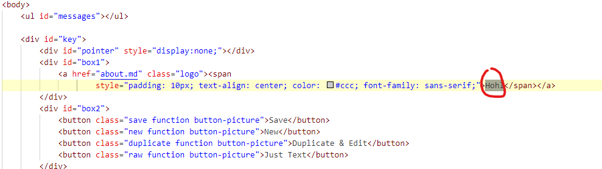
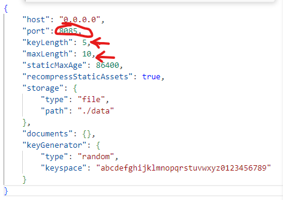
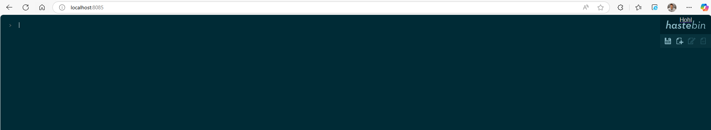

Les étapes pour la construire et la lancer via Docker.  

- Reprendre les Fichier config.json et index.html fourni  
- Modifier ces fichiers pour y apporter les modifications personnelles.  
- Créer le Fichier DockerFile  
- build l'image à partir du Dockerfile(commande: docker build -t test .)  
- Créer le container basé sur l'image créé (commande: docker run --name test -d -p 8085:8085 test)  

Les personnalisations apportées.  
  
  

Des captures d’écran commentées.  
  
On peut voir sur ce screanshot que l'application est bien atteignable sur le port 8085, le nom apparait en haut à droite et le logo de twitter n'est plus là.
